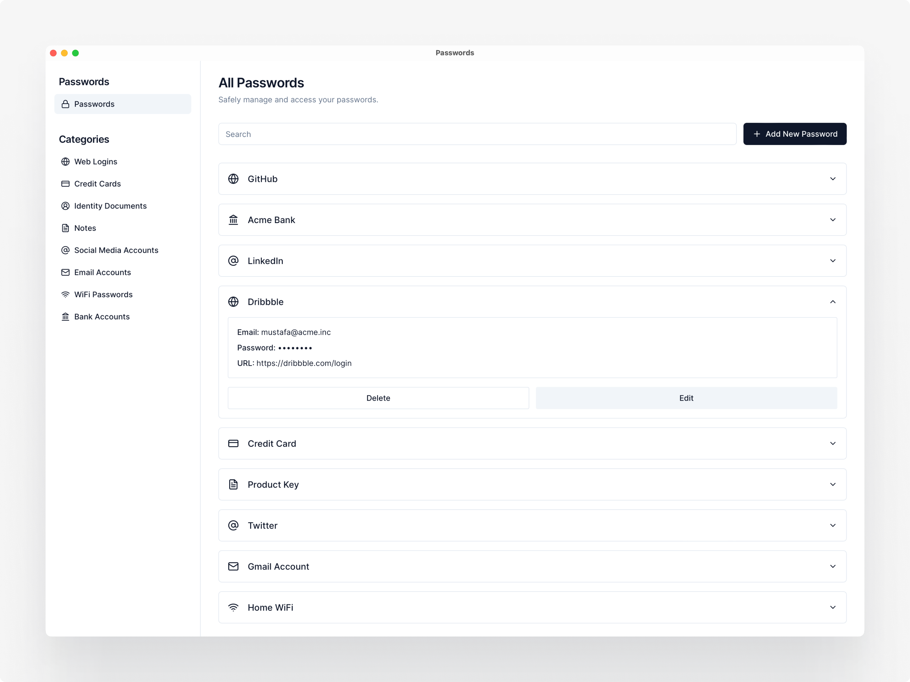

# Passwords (Temporary name WIP)

Passwords is an open-source desktop application designed to streamline password management. It provides a secure and intuitive user experience, leveraging Tauri and Next.js technologies.




## Table of Contents

- [Features](#features)

- [Used Technologies](#used-technologies)

- [Run Locally](#run-locally)

- [Contribution](#contribution)

- [License](#license)

- [Screenshots](#screenshots)

- [Download App](#download-app)

## Features

1. **Secure and Organized Password Management:** Access and manage your encrypted passwords through a secure user authentication page. Add, edit, delete, and organize passwords into different categories for easy access.

2. **Advanced Password Features:** Generate strong, customizable passwords based on user preferences. Calculate password strength in real-time to ensure robust security.

3. **User-Friendly and Internationalized:** Enjoy a modern, intuitive interface with pre-designed forms for various password types. Enable internationalization with i18next to provide localized language options.

4. **Built with Modern Technologies:** Developed with Tauri and Next.js for powerful web and desktop integration. Store passwords in an encrypted local file using CryptoJS for enhanced security.

## Used Technologies

- **Tauri**: Empower your app with the capabilities of Tauri, enabling seamless cross-platform deployment and access to native APIs for enhanced user experience.

- **Next.js**: Harness the power of Next.js, leveraging its static site generation (SSG) capabilities to create a user interface.

- **shadcn/ui**: Enhance your app's visual and interactive elements with components from shadcn/ui. These beautifully designed components can be seamlessly integrated into your application, offering accessibility, customizability, and open-source goodness.

- **CryptoJS**: Utilize CryptoJS for strong encryption, ensuring that sensitive information such as passwords is securely stored within the app's encrypted local file.

- **i18next**: Implement internationalization with i18next, enabling users to experience the app in their preferred language, enhancing global accessibility.

- **Lucide React**: Enhance the visual appeal of your app with icons from Lucide React, adding a touch of aesthetic sophistication to the user interface.

- **Tailwind CSS**: Employ Tailwind CSS for efficient styling, enabling rapid development through its utility-first approach and streamlined design workflow.

- **Tauri APIs**: Access native functionalities seamlessly through Tauri APIs, providing your app with the potential to interact with the user's system.

## Run Locally

To get a copy of Passwords up and running on your local machine, follow these steps:

1. **Install Tauri Prerequisites**:

   Before you begin, make sure you have the required tools and dependencies installed for Tauri. Follow the [Tauri Prerequisites Guide](https://tauri.app/v1/guides/getting-started/prerequisites) to set up your environment.

2. **Clone the repository**:

   ```bash
   git clone https://github.com/pekkiriscim/passwords.git
   ```

   ```bash
   cd passwords
   ```

3. **Install Dependencies**:

   Navigate into the project directory and install the required dependencies:

   ```bash
   npm install
   ```

4. **Run the Development Server**:

   Start the app in development mode with the following command:

   ```bash
   npm run tauri dev
   ```

5. **Build and Launch the Tauri App**:

   To build and launch the Tauri app, run the following command:

   ```bash
   npm run tauri build
   ```

## Contribution

Contributions to Passwords are welcomed and encouraged! If you're interested in improving the app, adding new features, fixing bugs, or enhancing documentation, your contributions are highly valued.

## License

Passwords(Temporary Name) is open-source software released under the MIT License.

The MIT License (MIT) is a permissive open-source license that allows you to use, modify, and distribute the software in your projects, both commercial and non-commercial, while providing attribution to the original authors.

